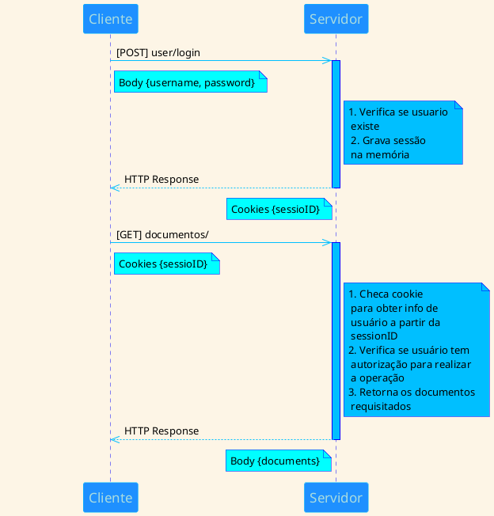
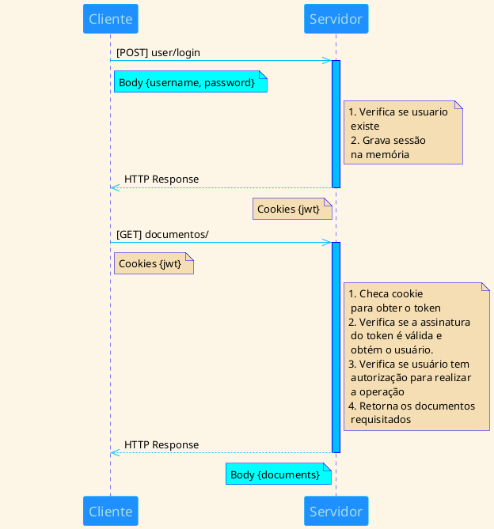

O HTTP é um protocolo de comunicação *stateless*. Ou seja, todas as interações realizadas entre cliente e servidor 
funcionam independentes uma da outra, e não guardam informações do que já foi trocado. Em outras palavras, não existe
um estado em comum. 

Contudo, existem interações nas quais é necessário manter o estado, pois mensagens subsequentes dependem 
de informações trocadas anteriormente. Por exemplo, em uma loja virtual, após colocarmos um produto no nosso carrinho 
de compras, não queremos que este produto desapareça caso decidamos ir para uma outra página comprar outros produtos 
ao invés de finalizar a compra imediatamente. Nós precisamos que o estado do carrinho de compras seja mantido
enquanto navegamos pelo site!

Uma das formas de superar esta limitação do HTTP é o uso de sessões de usuário.

#### Autenticação baseada em sessão

Em autenticação baseada em sessão, na primeira requisição que o cliente faz ao servidor, ou após o login do usuário, 
o servidor irá criar uma sessão. Sessões normalmente tem um id e informações específicas do estado da aplicação, 
como por exemplo, detalhes do usuário atualmente logado. O servidor, então, envia o id desta sessão na resposta ao 
cliente via cookie, o qual será guardado no browser do usuário. O cookie será sempre enviado nas comunicações 
subsequentes entre o cliente e o servidor. Toda vez que uma nova requisição chegar, o servidor porderá, atráves do id 
da sessão contida no cookie, identificar quem é o usuário e responder de acordo com o que foi requisitado.

> **Mais sobre cookies**
>
> https://en.wikipedia.org/wiki/HTTP_cookie
> This is something I want you to notice. It has a lot of text, and I want that text to wrap within a cell to the right of the `NOTE`, instead of under it.|

O servidor é responsável por manter todas as sessões ativas e controlar a invalidação e o tempo de expiração das sessões. 

#### Autenticação baseada em JWT

In the token based application, the server creates JWT with a secret and sends the JWT to the client. The client stores the JWT (usually in local storage) and includes JWT in the header with every request. The server would then validate the JWT with every request from the client and sends response.

The biggest difference here is that the user’s state is not stored on the server, as the state is stored inside the token on the client side instead. Most of the modern web applications use JWT for authentication for reasons including scalability and mobile device authentication.

Cookies normally work on a single domain or subdomains and they are normally disabled by browser if they work cross-domain (3rd party cookies). It poses issues when APIs are served from a different domain to mobile and web devices.

> **Mais sobre cookies**
>
> Problemas...

There is no issue with cookies as the JWT is included in the request header.
Token Based Authentication using JWT is the more recommended method in modern web apps. One drawback with JWT is that the size of JWT is much bigger comparing with the session id stored in cookie because JWT contains more user information. Care must be taken to ensure only the necessary information is included in JWT and sensitive information should be omitted to prevent XSS security attacks.

Escalabilidade

Múltiplos dispositivos / Cross-domain